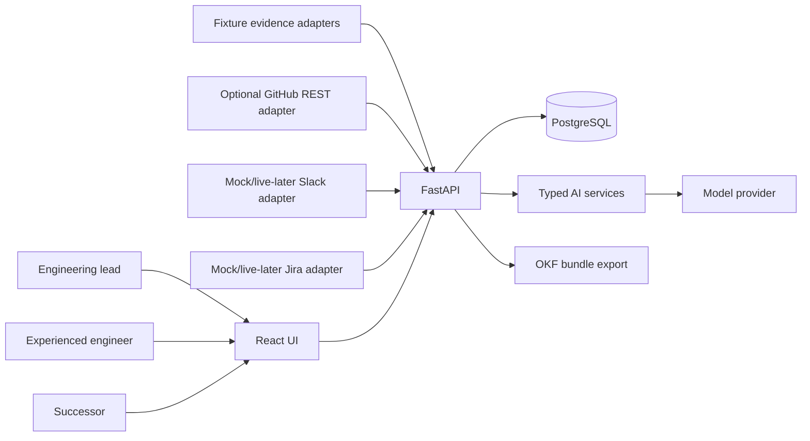

# 03 — Architecture

## Architecture style

Use a **modular monolith** for the hackathon:

- Frontend: React + TypeScript + Vite.
- Backend: Python + FastAPI + Pydantic.
- AI gateway: typed structured outputs (PydanticAI or direct provider SDK + Pydantic).
- Database: PostgreSQL.
- Tests: pytest + API integration tests + Playwright.

Do not introduce microservices, queues or a vector database unless a measured need appears during the build.

## System context



## Trust boundaries

1. Browser requests are untrusted.
2. Imported evidence is untrusted data, even when it contains instructions.
3. Model output is a proposal, not application truth.
4. Application code computes numeric scoring and enforces transitions.
5. Only explicit expert approval can publish knowledge.
6. Only approved knowledge can ground an exercise.
7. The successor never receives the private rubric before submission.
8. The model has no operational write tools.

## Backend modules

| Module | Responsibility |
|---|---|
| `evidence` | adapter import, normalization, hashing, chunking, source inventory |
| `analysis` | enrichment, operational-area discovery, event linking, actor/action extraction |
| `scoring` | deterministic signals, gates, confidence, ranking |
| `findings` | candidate lifecycle and expert review |
| `knowledge` | draft capture, approval, immutable versions, OKF projection |
| `exercise` | scenario/rubric generation, expert release |
| `assessment` | semantic criterion matching + deterministic aggregate result |
| `operations` | idempotency, provider status, errors, timing |
| `audit` | important state-changing events |

## Detect flow

1. Validate handoff and evidence bundle.
2. Freeze bundle snapshot/hash.
3. Normalize source records into the canonical evidence contract.
4. Persist evidence items and immutable chunks.
5. Ask AI to discover operational areas and referenced observations.
6. Validate references and structured output.
7. De-duplicate events and compute signals in code.
8. Apply confidence, gates and ranking.
9. Ask AI to explain supported candidates and draft one targeted question.
10. Validate, save and return candidates.

## Capture flow

1. Load original finding and evidence references.
2. Record expert confirm/correct/reject/obsolete action.
3. Capture missing context as a structured draft.
4. Validate required fields and unresolved items.
5. Approve an exact draft revision.
6. Create immutable `knowledge_version`.
7. Project/export the approved version as OKF.

## Verify flow

1. Generate draft scenario from one approved knowledge version.
2. Require each rubric criterion to map back to approved content.
3. Expert edits/releases the exercise.
4. Successor submits an answer; answer is persisted before evaluation.
5. AI proposes criterion-level matches and uncertainty.
6. Code derives aggregate result using critical-criterion rules.
7. Store feedback; retry creates a new immutable attempt.

## API shape

Recommended endpoints:

```text
POST /api/bundles/import
POST /api/handoffs
POST /api/handoffs/{id}/analyses
GET  /api/analyses/{id}
GET  /api/evidence/{id}
POST /api/findings/{id}/review
PUT  /api/findings/{id}/draft
POST /api/findings/{id}/publish
GET  /api/knowledge/{version_id}
GET  /api/knowledge/{version_id}/okf
POST /api/knowledge/{version_id}/exercises
PUT  /api/exercises/{id}/draft
POST /api/exercises/{id}/approve
GET  /api/exercises/{id}
POST /api/exercises/{id}/attempts
GET  /api/attempts/{id}
POST /api/attempts/{id}/reassess
GET  /api/operations/{id}
POST /api/demo/reset
```

## Mutation rules

- Mutations accept an `Idempotency-Key`.
- Same key + same request returns the previous result.
- Same key + different body returns `409`.
- Stale revision returns `409`.
- Invalid state transition returns `409`.
- Invalid input returns `422`.
- Model calls run outside long database write transactions; revision is rechecked before commit.

## Why PostgreSQL now?

Using PostgreSQL from the start avoids an unnecessary persistence migration in the core design and better matches the relational constraints this lifecycle needs: immutable versions, parent-child relationships, idempotent operations, JSONB metadata and auditable transitions. The MVP still remains a single-process modular monolith.
