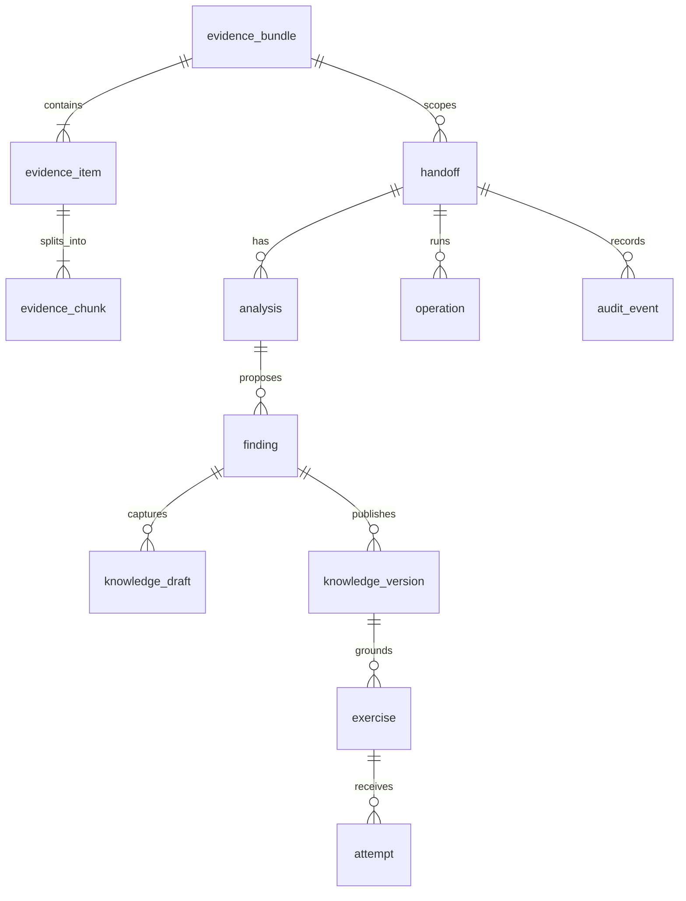

# 05 — PostgreSQL Data Model

## Design principles

Use relational constraints for identity, lifecycle and immutable history; use `jsonb` for source-specific metadata and bounded structured model output that does not justify a separate table.

Recommended extensions/types are intentionally minimal. UUIDs can be generated in application code or with PostgreSQL UUID support.

## Entity map



## 1. `evidence_bundle`

One frozen logical import used for one or more analyses.

| Field | Type | Meaning | Example |
|---|---|---|---|
| `id` | uuid PK | Internal stable ID | `7bb1...` |
| `project_key` | text | Project/service identifier | `payment-platform` |
| `schema_version` | text | Input manifest version | `evidence-bundle/1` |
| `content_hash` | text UNIQUE | Hash of normalized manifest/items | `sha256:...` |
| `source_inventory` | jsonb | Included/excluded/incomplete source families | `{ "github": "included", "slack": "included" }` |
| `coverage_start` | timestamptz null | Oldest evidence timestamp | `2026-07-01T00:00:00Z` |
| `coverage_end` | timestamptz null | Newest evidence timestamp | `2026-08-31T23:59:59Z` |
| `import_complete` | boolean | Whether requested bounded import completed | `true` |
| `created_at` | timestamptz | Persisted time | `...` |

## 2. `evidence_item`

One normalized source artifact.

| Field | Type | Meaning | Example |
|---|---|---|---|
| `id` | uuid PK | Internal item ID | `...` |
| `bundle_id` | uuid FK | Parent bundle | `...` |
| `source` | text | Provider family | `github`, `slack`, `jira`, `document` |
| `source_type` | text | Provider-specific semantic type | `pull_request_review` |
| `external_id` | text | Stable source identifier inside provider | `80` |
| `parent_external_id` | text null | Parent PR/thread/issue/event | `pr:12` |
| `author_id` | text null | Normalized actor ID | `alice` |
| `author_display_name` | text null | Display label | `Alice` |
| `participants` | jsonb | Relevant actor IDs/display labels | `["alice","bob"]` |
| `occurred_at` | timestamptz null | Source event time | `2026-08-18T10:30:00Z` |
| `title` | text null | Short source title | `Prevent duplicate settlement retry` |
| `normalized_text` | text | Bounded canonical text used for chunking | `...` |
| `source_url` | text null | Inspectable provider URL | `https://...` |
| `metadata` | jsonb | Source-specific fields | `{ "state": "APPROVED" }` |
| `payload_hash` | text | Hash of normalized source representation | `sha256:...` |
| `created_at` | timestamptz | Import time | `...` |

Constraint: `UNIQUE(bundle_id, source, external_id)`.

## 3. `evidence_chunk`

Immutable citation unit.

| Field | Type | Meaning | Example |
|---|---|---|---|
| `id` | uuid PK | Chunk ID cited by model/UI | `...` |
| `evidence_item_id` | uuid FK | Parent item | `...` |
| `ordinal` | int | Stable order inside item | `0` |
| `line_start` | int null | First normalized line | `1` |
| `line_end` | int null | Last normalized line | `12` |
| `text` | text | Exact citation text | `...` |
| `text_hash` | text | Integrity hash | `sha256:...` |

Constraint: `UNIQUE(evidence_item_id, ordinal)`.

## 4. `handoff`

Business workflow root.

| Field | Type | Meaning | Example |
|---|---|---|---|
| `id` | uuid PK | Handoff ID | `...` |
| `project_key` | text | Service/project | `payment-platform` |
| `bundle_id` | uuid FK | Frozen evidence bundle | `...` |
| `expert_id` | text | Experienced engineer ID | `alice` |
| `successor_id` | text | Successor ID | `bob` |
| `status` | text | High-level workflow status | `active` |
| `created_at` | timestamptz | Creation time | `...` |

## 5. `analysis`

One reproducible analysis snapshot for a selected engineer.

| Field | Type | Meaning | Example |
|---|---|---|---|
| `id` | uuid PK | Analysis ID | `...` |
| `handoff_id` | uuid FK | Parent handoff | `...` |
| `bundle_hash` | text | Hash frozen at analysis time | `sha256:...` |
| `selected_engineer_id` | text | Actor used for O/B signals | `alice` |
| `model_id` | text | Model used for extraction | `configured-model` |
| `prompt_version` | text | Prompt contract version | `detect/1` |
| `schema_version` | text | Structured output version | `analysis/1` |
| `scoring_version` | text | Deterministic rules version | `risk/1` |
| `extraction` | jsonb | Validated areas/actions/event links | `{...}` |
| `status` | text | `pending/running/succeeded/failed` | `succeeded` |
| `created_at` | timestamptz | Start/persist time | `...` |

## 6. `finding`

One candidate or abstention-worthy area from an analysis.

| Field | Type | Meaning | Example |
|---|---|---|---|
| `id` | uuid PK | Finding ID | `...` |
| `analysis_id` | uuid FK | Parent snapshot | `...` |
| `area_key` | text | Stable area identifier | `settlement-recovery` |
| `title` | text | Human-readable area | `Settlement Recovery` |
| `summary` | text | Evidence-backed interpretation | `...` |
| `question` | text | One targeted expert question | `What should on-call verify before retrying?` |
| `signal_values` | jsonb | A/D/O/M/B values and counts | `{ "A":1, "D":0.5, ... }` |
| `review_priority` | smallint null | 0–100 heuristic after gates | `88` |
| `evidence_confidence` | text | `high/medium/low` | `high` |
| `eligibility_status` | text | ranked/adequately_covered/insufficient/review_required | `ranked` |
| `status` | text | candidate/confirmed/rejected/obsolete | `candidate` |
| `revision` | int | Optimistic concurrency version | `1` |
| `evidence_refs` | jsonb | Validated chunk/source IDs | `[...]` |
| `created_at` | timestamptz | Persist time | `...` |
| `updated_at` | timestamptz | Last review edit | `...` |

`review_priority` is nullable because insufficient evidence must not be forced into a number.

## 7. `knowledge_draft`

Editable structured answer attached to one finding.

| Field | Type | Meaning |
|---|---|---|
| `id` | uuid PK | Draft ID |
| `finding_id` | uuid FK | Parent finding |
| `revision` | int | Exact draft revision |
| `content` | jsonb | Structured knowledge fields |
| `author_id` | text | Human who supplied/edited context |
| `created_at` | timestamptz | Created time |
| `updated_at` | timestamptz | Latest save |

Example `content`:

```json
{
  "applicability": "Fictional AcmePay provider settlement flow",
  "prerequisites": ["Existing settlement attempt can be located"],
  "steps": [
    "Check provider transaction state",
    "Check the idempotency key on the existing attempt"
  ],
  "stop_and_escalate": [
    "Do not create a new settlement when the provider confirms the original was accepted or settled",
    "Escalate when provider state is unknown or contradictory"
  ],
  "success_checks": ["Final reconciliation outcome is verified"],
  "limitations": [],
  "unresolved": []
}
```

## 8. `knowledge_version`

Immutable approved knowledge.

| Field | Type | Meaning | Example |
|---|---|---|---|
| `id` | uuid PK | Version ID | `...` |
| `finding_id` | uuid FK | Parent finding | `...` |
| `version_no` | int | Monotonic version | `1` |
| `approved_content` | jsonb | Exact approved structured content | `{...}` |
| `source_refs` | jsonb | Source/chunk provenance | `[...]` |
| `expert_added_context` | boolean | Marks new human knowledge | `true` |
| `approved_by` | text | Approver | `alice` |
| `approved_at` | timestamptz | Approval time | `...` |
| `content_hash` | text | Immutable content hash | `sha256:...` |
| `supersedes_version_id` | uuid null FK self | Previous version | `null` |

Constraints:

- `UNIQUE(finding_id, version_no)`.
- Approved content is never updated in place.

## 9. `exercise`

Scenario and private rubric tied to one approved version.

| Field | Type | Meaning |
|---|---|---|
| `id` | uuid PK | Exercise ID |
| `knowledge_version_id` | uuid FK | Frozen knowledge version |
| `scenario` | text | Successor-visible prompt |
| `rubric` | jsonb | Private criteria with critical flags and source mapping |
| `status` | text | draft/ready/obsolete |
| `revision` | int | Optimistic concurrency version |
| `approved_by` | text null | Expert releasing exercise |
| `approved_at` | timestamptz null | Release time |

## 10. `attempt`

Immutable learner answer and its assessment history.

| Field | Type | Meaning |
|---|---|---|
| `id` | uuid PK | Attempt ID |
| `exercise_id` | uuid FK | Frozen exercise |
| `successor_id` | text | Answering user |
| `answer` | text | Immutable submitted answer |
| `assessment_status` | text | pending/succeeded/failed |
| `criterion_results` | jsonb null | Model-proposed criterion matches after validation |
| `aggregate_result` | text null | demonstrated/partial/not_yet/review_required |
| `created_at` | timestamptz | Submission time |
| `assessed_at` | timestamptz null | Assessment completion |

## 11. `operation`

Tracks long-ish AI operations and idempotency.

| Field | Type | Meaning |
|---|---|---|
| `id` | uuid PK | Operation ID |
| `handoff_id` | uuid null FK | Workflow scope |
| `kind` | text | analyze/generate_exercise/assess/etc. |
| `idempotency_key` | text | Client mutation key |
| `request_hash` | text | Detect key reuse with different body |
| `state` | text | pending/running/succeeded/failed/interrupted |
| `result_type` | text null | Resource kind |
| `result_id` | uuid null | Resource ID |
| `error_code` | text null | Stable machine-readable error |
| `error_detail` | text null | Safe display/debug detail |
| `started_at` | timestamptz null | Start |
| `finished_at` | timestamptz null | End |
| `created_at` | timestamptz | Created |

Constraint: scope an idempotency key uniquely for the intended mutation boundary.

## 12. `audit_event`

Append-only record of important state changes.

| Field | Type | Meaning |
|---|---|---|
| `id` | bigserial/uuid PK | Event ID |
| `handoff_id` | uuid null FK | Workflow scope |
| `actor_id` | text | Human/system actor |
| `action` | text | `finding.confirmed`, `knowledge.approved`, etc. |
| `target_type` | text | Entity kind |
| `target_id` | uuid | Entity ID |
| `target_revision` | int null | Revision involved |
| `metadata` | jsonb | Safe supplemental context |
| `created_at` | timestamptz | Timestamp |

## Suggested indexes

```sql
create index idx_evidence_item_bundle_source_time
  on evidence_item(bundle_id, source, occurred_at);

create index idx_analysis_handoff_created
  on analysis(handoff_id, created_at desc);

create index idx_finding_analysis_priority
  on finding(analysis_id, eligibility_status, review_priority desc nulls last);

create index idx_knowledge_version_finding_version
  on knowledge_version(finding_id, version_no desc);

create index idx_attempt_exercise_created
  on attempt(exercise_id, created_at desc);

create index idx_operation_state_created
  on operation(state, created_at);
```

Use GIN on JSONB only after a concrete query needs it; do not index every metadata key speculatively.
